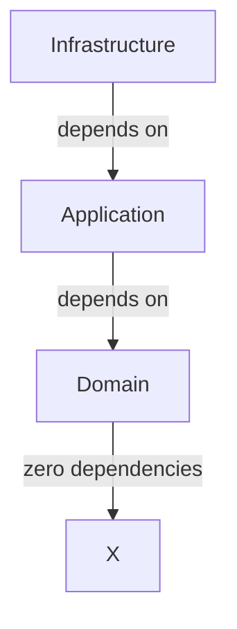

# Architecture Spine — Todolist MCP

## Design Paradigm

**Hexagonal Architecture (Clean Architecture / Ports & Adapters)**

```
┌─────────────────────────────────────────────────────────┐
│                    Application Core                        │
│  ┌──────────────┐    ┌──────────────┐    ┌──────────────┐  │
│  │   Domain      │    │  Application │    │  Infrastructure│  │
│  │  (Entities)   │◄───►│   (Use Cases)│◄───►│   (Adapters)  │  │
│  └──────────────┘    └──────────────┘    └──────────────┘  │
└─────────────────────────────────────────────────────────┘
         ▲                        ▲                        ▲
         │                        │                        │
   MCP Port               SQLite Port            Auth Port
```

**Layers mapping:**
- `src/todolist_mcp/domain/` — Domain entities and interfaces (ports)
- `src/todolist_mcp/application/` — Use cases and services
- `src/todolist_mcp/infrastructure/` — Adapters (MCP, SQLite, Auth)
- `src/todolist_mcp/__init__.py` — MCP server entry point

## Inherited Invariants

*Inherited from PRD (prd-Todolist-mcp-2026-08-31/prd.md)*

| Inherited | From PRD | Binds here |
| --- | --- | --- |
| Language: Python | §Conventions | All components must be Python 3.12+ |
| Protocol: MCP | §1 Vision | All external access via MCP protocol |
| Persistence: SQLite | §4.1 | Data storage via SQLite database |
| Auth: Single-user token | §4.4 | Token-based auth, single user |
| Scope: Mono-user | §2.2 | No multi-user support in v1 |

## Invariants & Rules

### AD-1 — Domain Entities are Framework-Agnostic

- **Binds:** Domain layer (Task, TaskRepository interfaces)
- **Prevents:** Domain logic coupled to MCP, SQLite, or any framework
- **Rule:** Domain entities must be pure Python with no external dependencies. All interfaces defined in domain layer.

### AD-2 — Dependency Flow is Inward

- **Binds:** All layers
- **Prevents:** Circular dependencies between layers
- **Rule:** Dependencies flow inward only: Infrastructure → Application → Domain. Domain has zero dependencies on other layers.



### AD-3 — MCP is the Only External Interface

- **Binds:** All external access (FR-1 through FR-13)
- **Prevents:** Direct HTTP, CLI, or other protocol access bypassing MCP
- **Rule:** All task operations must be exposed as MCP tools. No REST API, no direct CLI commands (except token generation).

### AD-4 — SQLite is the Sole Persistence

- **Binds:** Persistence layer
- **Prevents:** Multiple database backends or migration complexity in v1
- **Rule:** All data persistence uses SQLite via SQLAlchemy ORM. Database file location: `~/.todolist-mcp/todolist.db`

### AD-5 — Token Authentication is Mandatory

- **Binds:** All MCP tool calls (FR-12)
- **Prevents:** Unauthorized access to user's tasks
- **Rule:** Every MCP tool call must validate a token. Token stored in the SQLite database (auth_tokens table). CLI token generation via `todolist-mcp generate-token` (FR-13).

### AD-6 — Async-First Implementation

- **Binds:** All I/O operations (database, MCP)
- **Prevents:** Blocking operations that degrade performance
- **Rule:** All MCP tools and database operations must be async. Use `asyncio` and `async`/`await` pattern throughout.

### AD-7 — UUID v4 for Task IDs

- **Binds:** Task creation (FR-1)
- **Prevents:** ID collisions and predictable IDs
- **Rule:** Task IDs are UUID v4 strings. Server always generates IDs automatically; client-provided IDs are ignored (OQ-1 resolution).

### AD-8 — Local Timezone for Dates

- **Binds:** Date handling (FR-9, FR-10, FR-11)
- **Prevents:** Timezone confusion in single-user context
- **Rule:** All dates use local machine timezone. Format: `YYYY-MM-DD HH:MM:SS`. No timezone offset stored. Token stored in database per user validation.

## Consistency Conventions

| Concern | Convention |
| --- | --- |
| Naming (entities) | PascalCase for classes, snake_case for variables/functions |
| Naming (files) | snake_case.py for modules, PascalCase for class files |
| Data & formats | Pydantic v2 models for all DTOs, UUID strings for IDs, ISO-like local format for dates |
| State & mutation | Immutable DTOs, repository pattern for persistence, no direct DB access from application layer |
| Errors | Custom exceptions for domain errors, HTTP-like error codes for MCP responses |
| Logging | Structured logging via Python's logging module, JSON format for production |
| Config | Environment variables + config files, 12-factor app principles |
| Auth | Bearer token in MCP header or request parameter |

## Stack

| Name | Version | Purpose |
| --- | --- | --- |
| Python | 3.12 | Runtime |
| FastMCP | latest | MCP server framework |
| sqlalchemy | 2.x | ORM for SQLite |
| aiosqlite | latest | Async SQLite driver |
| pydantic | 2.x | Data validation and DTOs |
| uuid | stdlib | UUID v4 generation |
| typing | stdlib | Type hints |

## Structural Seed

```text
project-root/
├── src/
│   └── todolist_mcp/
│       ├── __init__.py          # MCP server entry (FastMCP), tool registration
│       ├── domain/
│       │   ├── __init__.py
│       │   ├── entities.py      # Task, Priority, TaskStatus enums
│       │   └── repositories.py  # TaskRepository (port/interface)
│       ├── application/
│       │   ├── __init__.py
│       │   ├── use_cases/
│       │   │   ├── __init__.py
│       │   │   ├── create_task.py
│       │   │   ├── get_task.py
│       │   │   ├── list_tasks.py
│       │   │   ├── update_task.py
│       │   │   ├── delete_task.py
│       │   │   └── complete_task.py
│       │   └── services/
│       │       └── auth_service.py
│       └── infrastructure/
│           ├── __init__.py
│           ├── mcp_adapter/
│           │   ├── __init__.py
│           │   └── server.py     # FastMCP server implementation
│           ├── sqlite_adapter/
│           │   ├── __init__.py
│           │   ├── models.py     # SQLAlchemy models (includes auth_tokens table)
│           │   └── repository.py # TaskRepository implementation
│           └── auth_adapter/
│               ├── __init__.py
│               └── token_manager.py
├── tests/
│   ├── unit/
│   │   ├── domain/
│   │   └── application/
│   └── integration/
│       └── mcp_tools/
├── pyproject.toml
└── _bmad-output/
    └── planning-artifacts/
```

## Capability → Architecture Map

| Capability / FR | Lives in | Governed by |
| --- | --- | --- |
| FR-1 (Create Task) | `application/use_cases/create_task.py` | AD-1, AD-2, AD-7 |
| FR-2 (Get Task) | `application/use_cases/get_task.py` | AD-1, AD-2 |
| FR-3 (List Tasks) | `application/use_cases/list_tasks.py` | AD-1, AD-2, AD-8 |
| FR-4 (Update Task) | `application/use_cases/update_task.py` | AD-1, AD-2 |
| FR-5 (Delete Task) | `application/use_cases/delete_task.py` | AD-1, AD-2 |
| FR-6 (Complete Task) | `application/use_cases/complete_task.py` | AD-1, AD-2 |
| FR-7, FR-8 (Priority) | `domain/entities.py` | AD-1 |
| FR-9, FR-10, FR-11 (Due Dates) | `domain/entities.py`, use_cases | AD-1, AD-8 |
| FR-12 (Auth) | `infrastructure/auth_adapter/`, `application/services/auth_service.py` | AD-5 (token in DB) |
| FR-13 (Token Gen) | `infrastructure/auth_adapter/token_manager.py` + CLI | AD-5 (token in DB) |

## Deferred

| Decision | Reason | Revisit when |
| --- | --- | --- |
| Multi-user support | v1 is mono-user only | Adding multi-user in v2 |
| Token rotation | Security risk acceptable for single-user | Security requirements increase |
| Task limits | No practical need for personal use | Scaling beyond personal use |
| Rate limiting | Not needed for single-user MCP | Public API or multi-user |
| Database migration | SQLite file-based, no schema changes expected | Schema changes needed |
| Advanced filtering | Basic filters sufficient for MVP | Complex query needs emerge |
| API versioning | MCP protocol handles versioning | Breaking changes to tools |
