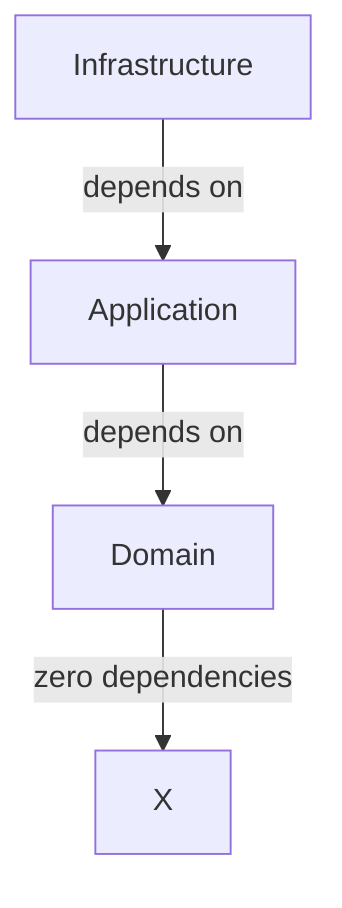

# Architecture Spine — Todolist MCP

## Design Paradigm

**Hexagonal Architecture (Clean Architecture / Ports & Adapters)**

```
┌─────────────────────────────────────────────────────────┐
│                    Application Core                        │
│  ┌──────────────┐    ┌──────────────┐    ┌──────────────┐  │
│  │   Domain      │    │  Application │    │  Infrastructure│  │
│  │  (Entities)   │◄───►│   (Use Cases)│◄───►│   (Adapters)  │  │
│  └──────────────┘    └──────────────┘    └──────────────┘  │
└─────────────────────────────────────────────────────────┘
         ▲                        ▲                        ▲
         │                        │                        │
   MCP Port               SQLite Port            Auth Port
```

**Layers mapping:**
- `src/todolist_mcp/domain/` — Domain entities and interfaces (ports)
- `src/todolist_mcp/application/` — Use cases and services
- `src/todolist_mcp/infrastructure/` — Adapters (MCP, SQLite, Auth)
- `src/todolist_mcp/__init__.py` — MCP server entry point

## Inherited Invariants

*Inherited from PRD (prd-Todolist-mcp-2026-08-31/prd.md)*

| Inherited | From PRD | Binds here |
| --- | --- | --- |
| Language: Python | §Conventions | All components must be Python 3.12+ |
| Protocol: MCP | §1 Vision | All external access via MCP protocol |
| Persistence: SQLite | §4.1 | Data storage via SQLite database |
| Auth: Single-user token | §4.4 | Token-based auth, single user |
| Scope: Mono-user | §2.2 | No multi-user support in v1 |
| Transport: HTTP | §4.5 | HTTP transport supported alongside stdio |
| Config: 12-factor | §4.5 | Config via env vars (`TODOLIST_MCP_HTTP_PORT`) |

## Invariants & Rules

### AD-1 — Domain Entities are Framework-Agnostic

- **Binds:** Domain layer (Task, TaskRepository interfaces)
- **Prevents:** Domain logic coupled to MCP, SQLite, or any framework
- **Rule:** Domain entities must be pure Python with no external dependencies. All interfaces defined in domain layer.

### AD-2 — Dependency Flow is Inward

- **Binds:** All layers
- **Prevents:** Circular dependencies between layers
- **Rule:** Dependencies flow inward only: Infrastructure → Application → Domain. Domain has zero dependencies on other layers.



### AD-3 — MCP is the Only External Interface

- **Binds:** All external access (FR-1 through FR-13)
- **Prevents:** Direct HTTP, CLI, or other protocol access bypassing MCP
- **Rule:** All task operations must be exposed as MCP tools. No REST API, no direct CLI commands (except token generation).

### AD-4 — SQLite is the Sole Persistence

- **Binds:** Persistence layer
- **Prevents:** Multiple database backends or migration complexity in v1
- **Rule:** All data persistence uses SQLite via SQLAlchemy ORM. Database file location: `~/.todolist-mcp/todolist.db`

### AD-5 — Token Authentication is Mandatory

- **Binds:** All MCP tool calls (FR-12)
- **Prevents:** Unauthorized access to user's tasks
- **Rule:** Every MCP tool call must validate a token. Token stored in the SQLite database (auth_tokens table). CLI token generation via `todolist-mcp generate-token` (FR-13).

### AD-6 — Async-First Implementation

- **Binds:** All I/O operations (database, MCP)
- **Prevents:** Blocking operations that degrade performance
- **Rule:** All MCP tools and database operations must be async. Use `asyncio` and `async`/`await` pattern throughout.

### AD-7 — UUID v4 for Task IDs

- **Binds:** Task creation (FR-1)
- **Prevents:** ID collisions and predictable IDs
- **Rule:** Task IDs are UUID v4 strings. Server always generates IDs automatically; client-provided IDs are ignored (OQ-1 resolution).

### AD-8 — Local Timezone for Dates

- **Binds:** Date handling (FR-9, FR-10, FR-11)
- **Prevents:** Timezone confusion in single-user context
- **Rule:** All dates use local machine timezone. Format: `YYYY-MM-DD HH:MM:SS`. No timezone offset stored. Token stored in database per user validation.

### AD-9 — Database Path is Environment-Configurable

- **Binds:** Persistence layer (`SQLiteTaskRepository`, `TokenManager`), containerization
- **Prevents:** Hardcoded paths that break volume mounts in Docker
- **Rule:** The SQLite database path must be configurable via the `TODOLIST_MCP_DB_PATH` environment variable. Default: `~/.todolist-mcp/todolist.db` for local use. In containers: `/data/todolist.db` (mounted volume). All components that open the database (`SQLiteTaskRepository.__init__`, `TokenManager.__init__`, `BearerTokenVerifier.__init__`) must read this env var as their default `db_path`.

### AD-10 — Container Runs HTTP Transport by Default

- **Binds:** Transport configuration (FR-16), containerization
- **Prevents:** stdio mode inside a container (no interactive terminal)
- **Rule:** The Docker container defaults to `--transport http` via the `TODOLIST_MCP_TRANSPORT` env var (default: `http`). stdio remains available for local non-containerized use only. The container exposes port 8080 (configurable via `TODOLIST_MCP_HTTP_PORT`).

### AD-11 — Container Image is Non-Root and Minimal

- **Binds:** Dockerfile, containerization
- **Prevents:** Running as root inside the container (security risk)
- **Rule:** The Docker image uses a multi-stage build on `python:3.12-slim`. The runtime stage runs as a non-root user (`todolist`). The image contains only runtime dependencies — no dev tools, no source control metadata.

### AD-12 — Container Persistence via Volume Mount

- **Binds:** Persistence layer (AD-4), containerization
- **Prevents:** Data loss when the container is recreated
- **Rule:** The SQLite database file lives at `/data/todolist.db` inside the container, backed by a Docker named volume (`todolist-mcp-data`). The `/data` directory is created with correct ownership (user `todolist`) during the build.

## Consistency Conventions

| Concern | Convention |
| --- | --- |
| Naming (entities) | PascalCase for classes, snake_case for variables/functions |
| Naming (files) | snake_case.py for modules, PascalCase for class files |
| Data & formats | Pydantic v2 models for all DTOs, UUID strings for IDs, ISO-like local format for dates |
| State & mutation | Immutable DTOs, repository pattern for persistence, no direct DB access from application layer |
| Errors | Custom exceptions for domain errors, HTTP-like error codes for MCP responses |
| Logging | Structured logging via Python's logging module, JSON format for production |
| Config | Environment variables + config files, 12-factor app principles |
| Auth | Bearer token in MCP header or request parameter |
| Container | Multi-stage Docker build, non-root user, slim base image |

## Container Configuration

### Environment Variables

| Variable | Default (local) | Default (container) | Purpose |
| --- | --- | --- | --- |
| `TODOLIST_MCP_DB_PATH` | `~/.todolist-mcp/todolist.db` | `/data/todolist.db` | SQLite database file path (AD-9) |
| `TODOLIST_MCP_TRANSPORT` | `stdio` | `http` | Transport mode: stdio, http, both (AD-10) |
| `TODOLIST_MCP_HTTP_PORT` | `8080` | `8080` | HTTP port when transport is http or both (FR-16) |

### Dockerfile Strategy

Multi-stage build on `python:3.12-slim`:

```
Stage 1: builder
  ├── Install uv
  ├── Copy pyproject.toml + uv.lock
  ├── uv sync --no-dev (production deps only)
  └── Copy src/

Stage 2: runtime
  ├── python:3.12-slim base
  ├── Create non-root user `todolist` (uid 1000)
  ├── Create /data directory owned by todolist
  ├── Copy installed packages + app from builder
  ├── Set env: TODOLIST_MCP_DB_PATH=/data/todolist.db
  ├── Set env: TODOLIST_MCP_TRANSPORT=http
  ├── Expose port 8080
  ├── VOLUME /data
  ├── Healthcheck: GET /mcp/tools via python
  └── ENTRYPOINT: python -m todolist_mcp
```

### docker-compose.yml Strategy

```yaml
services:
  todolist-mcp:
    build: .
    ports:
      - "8080:8080"
    volumes:
      - todolist-mcp-data:/data
    environment:
      - TODOLIST_MCP_DB_PATH=/data/todolist.db
      - TODOLIST_MCP_TRANSPORT=http
      - TODOLIST_MCP_HTTP_PORT=8080
    restart: unless-stopped

volumes:
  todolist-mcp-data:
```

### .dockerignore Exclusions

```
.git
.gitignore
_bmad-output/
tests/
__pycache__/
*.pyc
.env
.venv
.ruff_cache
.pyright
docs/
```

## Stack

| Name | Version | Purpose |
| --- | --- | --- |
| Python | 3.12 | Runtime |
| FastMCP | latest | MCP server framework |
| sqlalchemy | 2.x | ORM for SQLite |
| aiosqlite | latest | Async SQLite driver |
| pydantic | 2.x | Data validation and DTOs |
| uuid | stdlib | UUID v4 generation |
| typing | stdlib | Type hints |
| uv | latest | Package manager (also used in Docker build) |
| Docker | latest | Container runtime |
| python:3.12-slim | 3.12 | Docker base image |

## Structural Seed

```text
project-root/
├── src/
│   └── todolist_mcp/
│       ├── __init__.py          # MCP server entry (FastMCP), tool registration
│       ├── __main__.py          # `python -m todolist_mcp` entry
│       ├── cli.py               # CLI: generate-token, run server
│       ├── domain/
│       │   ├── __init__.py
│       │   ├── entities.py      # Task, Priority, TaskStatus enums
│       │   └── repositories.py  # TaskRepository (port/interface)
│       ├── application/
│       │   ├── __init__.py
│       │   ├── use_cases/
│       │   │   ├── __init__.py
│       │   │   ├── create_task.py
│       │   │   ├── get_task.py
│       │   │   ├── list_tasks.py
│       │   │   ├── update_task.py
│       │   │   ├── delete_task.py
│       │   │   └── complete_task.py
│       │   └── services/
│       │       └── auth_service.py
│       └── infrastructure/
│           ├── __init__.py
│           ├── mcp_adapter/
│           │   ├── __init__.py
│           │   └── server.py     # FastMCP server implementation
│           ├── sqlite_adapter/
│           │   ├── __init__.py
│           │   ├── models.py     # SQLAlchemy models (includes auth_tokens table)
│           │   └── repository.py # TaskRepository implementation (reads TODOLIST_MCP_DB_PATH)
│           └── auth_adapter/
│               ├── __init__.py
│               ├── bearer_verifier.py  # Reads TODOLIST_MCP_DB_PATH
│               ├── models.py
│               └── token_manager.py    # Reads TODOLIST_MCP_DB_PATH
├── tests/
│   ├── unit/
│   │   ├── domain/
│   │   └── application/
│   └── integration/
│       └── mcp_tools/
├── Dockerfile                  # Multi-stage build: uv install → slim runtime, non-root
├── docker-compose.yml          # Service def: port 8080, volume for /data, env vars
├── .dockerignore               # Exclude .git, tests, _bmad-output, __pycache__, etc.
├── pyproject.toml
└── _bmad-output/
    └── planning-artifacts/
```

## Capability → Architecture Map

| Capability / FR | Lives in | Governed by |
| --- | --- | --- |
| FR-1 (Create Task) | `application/use_cases/create_task.py` | AD-1, AD-2, AD-7 |
| FR-2 (Get Task) | `application/use_cases/get_task.py` | AD-1, AD-2 |
| FR-3 (List Tasks) | `application/use_cases/list_tasks.py` | AD-1, AD-2, AD-8 |
| FR-4 (Update Task) | `application/use_cases/update_task.py` | AD-1, AD-2 |
| FR-5 (Delete Task) | `application/use_cases/delete_task.py` | AD-1, AD-2 |
| FR-6 (Complete Task) | `application/use_cases/complete_task.py` | AD-1, AD-2 |
| FR-7, FR-8 (Priority) | `domain/entities.py` | AD-1 |
| FR-9, FR-10, FR-11 (Due Dates) | `domain/entities.py`, use_cases | AD-1, AD-8 |
| FR-12 (Auth) | `infrastructure/auth_adapter/`, `application/services/auth_service.py` | AD-5 (token in DB) |
| FR-13 (Token Gen) | `infrastructure/auth_adapter/token_manager.py` + CLI | AD-5 (token in DB) |
| FR-14 (HTTP Transport) | `infrastructure/mcp_adapter/`, `__init__.py` (main) | AD-3, AD-10 (container HTTP default) |
| FR-15 (HTTP Auth) | `infrastructure/auth_adapter/bearer_verifier.py` | AD-5 (token in DB) |
| FR-16 (Transport Config) | `__init__.py` (main), `cli.py` | AD-10, AD-9 (env vars) |
| Containerization | `Dockerfile`, `docker-compose.yml`, `.dockerignore` | AD-9, AD-10, AD-11, AD-12 |

## Deferred

| Decision | Reason | Revisit when |
| --- | --- | --- |
| Multi-user support | v1 is mono-user only | Adding multi-user in v2 |
| Token rotation | Security risk acceptable for single-user | Security requirements increase |
| Task limits | No practical need for personal use | Scaling beyond personal use |
| Rate limiting | Not needed for single-user MCP | Public API or multi-user |
| Database migration | SQLite file-based, no schema changes expected | Schema changes needed |
| Advanced filtering | Basic filters sufficient for MVP | Complex query needs emerge |
| API versioning | MCP protocol handles versioning | Breaking changes to tools |
| Docker health endpoint | Using `/mcp/tools` as implicit healthcheck | Need dedicated `/health` endpoint |
| Docker image registry | Not publishing to a registry in v1 | CI/CD pipeline for automated builds |
| Kubernetes manifests | Docker Compose sufficient for single-user | Multi-instance or cloud deployment |
